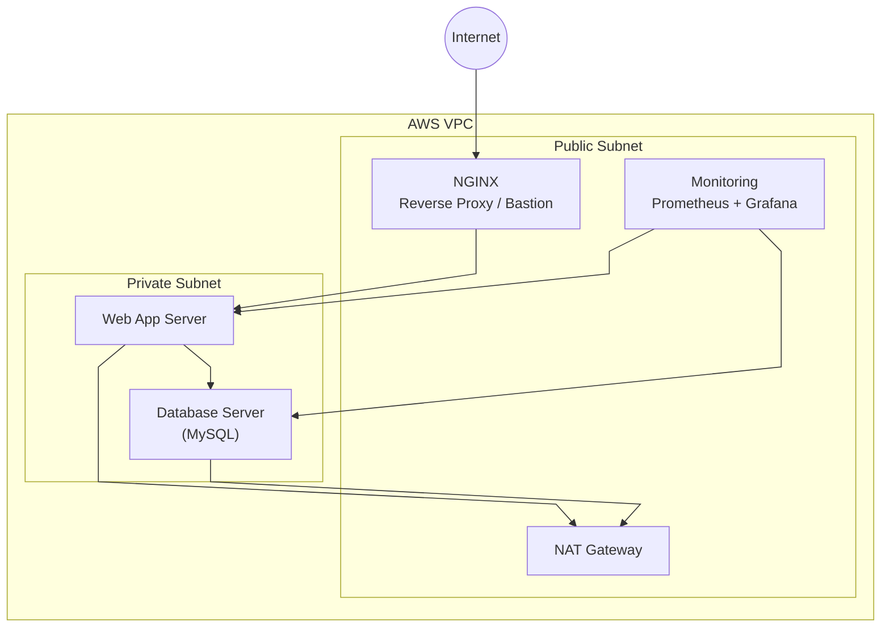

## Architecture Overview

The following diagram shows the current AWS architecture, including
public and private subnets, ingress via NGINX, monitoring, and NAT egress.

```mermaid
%%{init: { "flowchart": { "curve": "linear" } }}%%
flowchart TB
    Internet((Internet))

    subgraph VPC["AWS VPC"]

        subgraph PublicSubnet["Public Subnet"]
            NGINX["NGINX\nReverse Proxy / Bastion"]
            Monitoring["Monitoring\nPrometheus + Grafana"]
            NAT["NAT Gateway"]
        end

        subgraph PrivateSubnet["Private Subnet"]
            App["Web App Server"]
            DB["Database Server\n(MySQL)"]
        end
    end

    Internet --> NGINX
    NGINX --> App
    App --> DB

    Monitoring --> App
    Monitoring --> DB

    App --> NAT
    DB --> NAT
```
